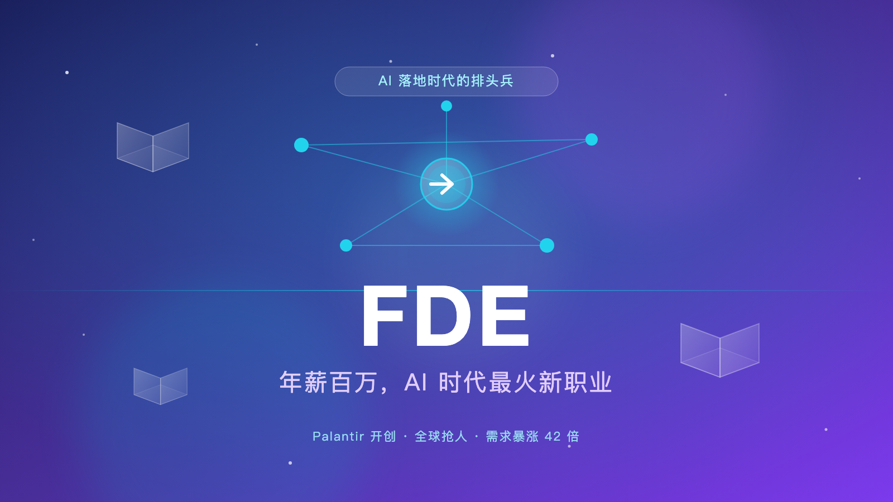

-----

## A number that stunned the job market

In the spring of 2026, something unusual showed up in Silicon Valley's job market.

A single job title saw its hiring demand jump 729% in one year, while job postings on LinkedIn grew 42x in three years. This isn't a brand-new industry — it's one specific role: **FDE** (Forward Deployed Engineer).

OpenAI is hiring. Anthropic is hiring. Google Cloud opened more than 1,500 related roles at once. ByteDance's Doubao and Feishu teams are competing for talent with generous offers.

Six-figure offers in dollars, million-yuan packages in China — they're everywhere.

FDE is becoming the hottest new career in the AI era. In this article, we'll look at what it actually is, why it suddenly exploded, and how to plan your path if you want in.

## What exactly is an FDE?

In one sentence: **an FDE is an engineer who embeds inside the client's company and gets AI working there — by hand.**

You might think: isn't that just outsourced on-site work?

Not quite. The difference comes down to three words — **"ownership of the outcome."**

Traditional outsourcing delivers *deliverables*: a proposal document, a demo, a launch. Once it's signed off, the responsibility ends.

An FDE promises *outcomes*: write the code, build the system, and teach the client to use it — until the AI actually changes how the client works.

Palantir's internal motto captures this culture perfectly: **"Don't sell software. Deploy outcomes."**

## The story starts with Palantir

You can't talk about FDE without its pioneer — **Palantir Technologies**.

Founded by Peter Thiel, Palantir started by building big-data analytics software for government and defense clients like the CIA, NSA, and the U.S. Army.

But along the way, Palantir hit an awkward problem: **customers bought the software, and then didn't know how to use it.**

The software was too complex, the data too messy, the business logic too varied. Selling the product alone meant it just gathered dust.

So they made a bold decision for the time: **send engineers directly to the client site.**

Engineers sat next to CIA analysts to study how they worked. They stood by hospital beds to see how nurses documented patient conditions. They walked factory floors to watch how production data flowed.

Then they changed the software, changed the processes, and sometimes redesigned the client's way of working — until the software actually ran.

Palantir split its deployed engineers into two teams:
- **Echo team**: on-site analysts who understand client needs and manage relationships;
- **Delta team**: software engineers whose core strength is shipping usable prototypes in record time.

(The name "Delta" is itself a military term, evoking "forward deployment.")

By 2016, Palantir employed more FDEs than traditional software engineers. Wall Street analysts called the role Palantir's **"secret weapon."**

## What does an FDE actually do day to day?

Palantir's own recruiting copy has a line that sticks with you:

> "From hospital beds to factory floors, Forward Deployed Engineers embed themselves in the customer's reality until the problem is theirs."

That's the essence of the role: **work shoulder to shoulder with the client, and make their problems yours.** The work roughly splits into three zones:

**🔍 Diagnostic** — figure out where the client's data pipeline breaks, why the LLM calls keep failing, why the RAG retrieval results are degrading.

**🛠️ Build** — write real production-grade code: data pipelines, model tuning, UI, plus monitoring and documentation, because the client's team has to maintain it after the engagement ends.

**💬 Translation** — turn what you observe on the ground into decisions the client's product and platform teams can act on. Technical language has to make sense to business people.

In short: **an FDE is a software engineer + data engineer + consultant + project manager rolled into one.** Some say one FDE is an army.

## Why is it exploding right now?

FDE has existed for over a decade. Why is it suddenly hot?

Because the AI industry has reached a turning point: **the model is no longer the problem — deployment is the last, and hardest, mile.**

Over the past two years, LLM "intelligence" has advanced dramatically. But after enterprises buy AI, the real obstacles surface:

Historical data scattered across a dozen Excel files — is the format right? Can the legacy ERP be integrated? Which approval chain does a decision follow? How do compliance and security fit?

None of these are technical problems. They're **organizational problems**. The technology is only 20%; the other 80% is internal politics, allocation of authority, and legacy baggage.

Two real examples:

Goldman Sachs wanted to roll out an AI audit system — and got stuck for six months on the compliance team's question of "who's accountable."

Target partnered with Palantir on AI-driven buying — and tore up the contract after its senior buyers' team pushed back collectively.

The AI giants finally realized: selling the model alone makes no money if clients can't use it.

So in May 2026, three giants moved at once:

- **Anthropic** joined forces with Blackstone, Goldman Sachs, and others to launch a $1.5 billion joint venture dedicated to deploying Claude inside enterprises;
- **OpenAI** announced DeployCo, a deployment subsidiary with an initial investment of over $4 billion, and acquired the on-site consultancy Tomoro, absorbing about 150 FDEs in one stroke;
- **Google Cloud**'s CEO publicly declared a massive FDE hiring push, opening more than 1,500 AI-deployment-related roles.

The center of competition is shifting from "whose model is stronger" to "who can turn a model into an enterprise's production system."

FDE is the spearhead of this deployment war.

## How attractive is the pay?

Let's get down to the money.

**Overseas:**
- **Anthropic**: entry-level FDE base salary of $170k–$200k, with total compensation (base + equity) reaching $300k–$500k;
- **OpenAI**: FDE base salary starts at $210k;
- **Perspective AI's survey**: senior FDEs at frontier labs earn a median total comp of $485,000.

**In China:**
- **ByteDance** (Doubao / Feishu): monthly salary RMB 35k–70k with 15 months, topping out at about RMB 1.05 million a year;
- **Alibaba Cloud**: RMB 20k–50k per month with 16 months;
- **Ant Digital**: RMB 40k–60k per month with 15 months.

Tempting, no doubt. But note: the million-yuan packages concentrate on **top talent** — they're not the industry average. A mid-level FDE earning RMB 20k–30k a month is perfectly normal.

## Want in? Here's your roadmap

If you're tempted, save this plan.

**First, build a T-shaped skill set.**

The vertical bar is solid software engineering: Python, SQL, TypeScript; data engineering (ETL, data warehouses); LLM application frameworks (LangChain, RAG, agents, workflows); full-stack development.

The horizontal bar is business breadth: understanding how companies operate, spotting industry pain points, and speaking the language of business people.

**Second, take "hands-on delivery" to the extreme.**

FDE values two abilities above all: rapid learning and getting to the essence of things. Those are the two words recruiters use most.

How to practice? Take real projects and build from 0 to 1. Other people's projects "just need to run" — you want yours to run *and* for the client to actually use it.

**Third, work on soft skills — communication and patience above all.**

This is the part people ignore, and it's the most unforgiving.

An FDE faces ambiguous requirements every day. Clients often can't articulate what they want, and you have to help them untangle the real problem layer by layer. On top of that, you'll spend a lot of time persuading people who deeply distrust AI.

Anthropic's job postings carry a telling requirement: **"keep a low ego and a collaborative attitude."**

Be technically strong, but stay humble — put your ego aside in front of clients and patiently understand why they don't trust AI output.

**Fourth, pivot over from an adjacent role.**

In the U.S., FDE usually isn't an entry-level position; it typically wants a few years of product management or development experience. A product background is a natural fit — you're already used to "understanding needs and defining problems."

Developers can pivot too — just fill in the business-understanding gap.

## A dose of cold water: it's not all glamour

After the upside, let's be honest about the downsides.

McCadden, a former Palantir FDE and the founder of the startup Hex, once described the real life of an FDE like this:

> "Spending a lot of time on planes, sleeping in three-star hotels, working in dim windowless conference rooms with no outlets."

Travel can run 25%–50% of your time, and engagements last 3–12 months. And you might spend six months building something the client never uses.

More sobering: **Gartner predicts that by 2028, 70% of enterprises will be forced to abandon FDE-led agentic AI solutions** — because vendor costs are too high and enterprises lack the ability to evolve independently.

There's also a deeper concern. Some argue FDE is the "model companies' scheme": while FDEs help enterprises deploy agents, they also distill the enterprise's business processes and domain knowledge into prompts and workflows. That knowledge eventually flows back to the model companies to train the next, more powerful generation of models.

In plain terms: **FDE is a moat — but not a permanent one.**

## Summary

The FDE boom is the inevitable result of the AI industry moving from "building models" to "building outcomes."

For enterprises, it solves the "we bought AI but can't use it" deployment problem. For individuals, it's a rare career window — a role that bridges code and business, technology and reality.

The prospects are real, but stay clear-eyed: it demands a rare combination of technical depth, business understanding, and communication patience, alongside high intensity, heavy travel, and uncertain results.

The next 1–2 years are the window for traditional enterprises to undergo AI transformation — and FDE's golden window.

If you're on the fence about getting in, my advice is: **master the technical fundamentals first, then find a real project and put AI to work on the ground.**

Because in the AI era, what's scarcest isn't people who can write code — it's people who can make AI actually create value.

> Want to learn more? Palantir careers: https://www.palantir.com/careers/
