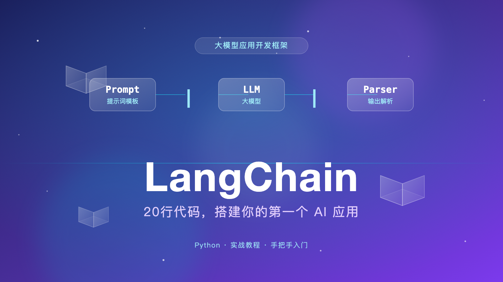

-----


## Have you ever written code like this?

Have you ever tried to call a large language model API by hand?

I'm guessing most people go through the same first attempt: stitching the prompt together with an f-string, firing off an HTTP request, digging through the response to find the `content` field, and then wrestling with timeouts, error handling, and retries...

Tedious, right?

And here's the worst part: today you use OpenAI, tomorrow you want to switch to DeepSeek, or add a memory feature — and the code basically has to be rewritten from scratch.

Isn't there a framework that makes "calling a model" fast and elegant?

Yes. It's called **LangChain**.

In this article, I won't drown you in dry theory. I'll walk you through a small project that actually runs — so that within 20 minutes, with about 20 lines of code, you'll have built your first AI app.

## What is LangChain?

Let's start with an analogy to give you a feel for it.

Think of a large language model (GPT, DeepSeek, Qwen) as an **engine**. An engine is powerful, but it's just a single component — it doesn't drive anywhere on its own.

LangChain is the **car frame**: the steering wheel, dashboard, and gearbox are all already mounted. All you have to do is drop the engine in.

In official terms, LangChain is an **application development framework for large language models**. It takes all the "same old" work in every AI app — managing prompts, calling models, parsing outputs, storing memory, hooking up tools, searching documents — and packages it into standard, reusable parts.

And these parts can be connected with a "pipeline."

## Three core concepts, explained in one minute

LangChain has a lot of parts, but beginners only need to remember three:

**① Model**: the part that "thinks." For example, `ChatOpenAI`, through which we call GPT, DeepSeek, and other LLMs.

**② Prompt Template**: the part that "structures the question." You just leave placeholders and fill in the parameters; it generates a well-formed prompt automatically.

**③ Output Parser**: the part that "cleans up the answer." It converts the model's messy response into clean plain text or JSON.

String these three parts together with the pipe operator `|`, and you get a "chain":

```
prompt | llm | parser
```

Doesn't it look like a Linux pipe command? That's the core idea of LangChain — **everything can be chained**.

Enough theory. Let's get to the code.

## Hands-on: build an AI Q&A assistant in 20 lines

We'll build something genuinely useful: an **AI Q&A assistant**. You give it a role, throw it a question, and it answers in character.

For example, you can cast it as a "personal fitness coach" to answer "how to recover from a month of overtime," or as a "primary school Chinese teacher" to explain a reading-comprehension question to your kid.

### Step 1: Install

Open your terminal and run:

```bash
pip install langchain langchain-openai python-dotenv
```

That's all — three packages: `langchain` is the core framework, `langchain-openai` connects to the model, and `python-dotenv` loads your secret key from a config file.

### Step 2: Set up your API key

Create a new file in your project folder called `.env` and add your API key:

```bash
OPENAI_API_KEY=sk-your-key
```

> 💡 **No OpenAI key?** You can use DeepSeek or other models with an OpenAI-compatible API — the code barely changes. See the note at the end.

### Step 3: Write the code

Create `main.py` and paste this in:

```python
import os
from dotenv import load_dotenv
from langchain_openai import ChatOpenAI
from langchain_core.prompts import ChatPromptTemplate
from langchain_core.output_parsers import StrOutputParser

# Load the secret key from .env
load_dotenv()

# ① Model: the part that "thinks"
llm = ChatOpenAI(model="gpt-4o-mini", temperature=0.7)

# ② Prompt template: {role} and {question} are the placeholders
prompt = ChatPromptTemplate.from_template(
    "You are a {role}. Please answer the question below in clear, plain language, within 100 words.\n\nQuestion: {question}"
)

# ③ Output parser: cleans the response into plain text
parser = StrOutputParser()

# ④ Chain the three parts together with | 
chain = prompt | llm | parser

# ⑤ Run the chain
result = chain.invoke({
    "role": "senior fitness coach",
    "question": "I've been working overtime for a month and feel exhausted. How can I recover my energy quickly at home?"
})
print(result)
```

Yes — the core logic is just about 20 lines.

### Step 4: Run it

```bash
python main.py
```

You should see an output roughly like this:

> Don't push through it! Try this instead: ① get 7 hours of sleep every night, even if it's split up; ② do 5 minutes of deep breathing or stretching during work breaks; ③ stay away from your phone before bed and drink some warm water; ④ schedule one 30-minute brisk walk on the weekend, but no intense exercise. Recovery is a marathon, not a sprint.

Now switch the role and ask a different question:

```python
result = chain.invoke({
    "role": "primary school Chinese teacher",
    "question": "How can I help my third-grader improve their reading comprehension?"
})
```

Notice that **you didn't change a single line of code** — you just swapped a parameter, and the AI switched personas.

That's the power of templates + chains.

## What would the code look like without LangChain?

You can't appreciate its value until you see the alternative.

Without LangChain, the same feature means writing everything yourself: manually building the prompt, making the HTTP request, parsing the JSON, handling all the exceptions...

Every step is boilerplate. The code balloons to two or three times the size — and the moment you change models or add parameters, you're rewriting it.

With LangChain, the core is one pipeline:

```python
chain = prompt | llm | parser
```

Clear logic, easy to modify — want to switch models? Change one line. Want to add memory? Attach another part to the chain.

That's the point of a framework: **it does the repetitive work so you can focus on your actual problem.**

## From one assistant to a real AI app

The example above is just the starting point. Where LangChain really shines is its rich library of components. As your needs grow, you just "attach" more parts to the chain:

**Add memory** — the AI remembers what you talked about before, so multi-turn conversations are no longer amnesiac.

**Add tools** — the AI can check the weather, look up the time, do math, or call your own functions. It evolves from a "chat machine" into an "agent" that gets things done.

**Add retrieval (RAG)** — feed it your documents, PDFs, or database, and it answers based on your own material — a "private knowledge-base Q&A."

**Add orchestration (LangGraph)** — when the workflow gets complex, LangGraph organizes the steps into a graph and lets the AI decide which branch to take.

The learning path is clear: **get the basic chain running → build multi-turn conversations → hook up tools → build document Q&A**. Every step raises your game.

## Why choose it?

Finally, why LangChain instead of building your own?

**First, you can switch models freely.** The interface is unified — today GPT, tomorrow DeepSeek, the day after Qwen. Change one line of config and your business logic stays untouched. In an era of rapidly iterating models, that matters a lot.

**Second, components are reusable.** Prompts, parsers, memory, and retrieval are all standard parts. Write once, use everywhere, and share with the community.

**Third, the ecosystem is mature.** Official companions like LangSmith (debugging and tracing), LangGraph (workflow orchestration), and LangServe (quick deployment) cover everything from development to launch.

**Of course, it has "flaws" too.** Versions change fast, and there are a lot of concepts. Many old tutorials online still target deprecated APIs. My advice: **always follow the latest official docs**, and treat "it runs" as the source of truth.

## 3 pitfalls every beginner hits

Almost everyone stumbles on these when starting with LangChain — let's clear them out of the way early.

**① Don't hard-code your API key.** Load it from a `.env` file with `load_dotenv()` — safer, and easier to switch environments. And please: never commit your key to GitHub, or scrapers will sweep it up.

**② Versions change; APIs change.** LangChain iterates quickly, and plenty of old tutorials still use the deprecated `LLMChain` style. If you copy code and it errors out, it's probably not your fault — the version moved on. The most reliable fix is checking the official docs. You can also pin a version, e.g. `pip install langchain==0.3.*`, so an upgrade can't silently break your project.

**③ The prompt shapes the outcome more than the model does.** Give the same model a clear role and output format, and the quality changes immediately. The `{role}` and `{question}` placeholders are your two tuning knobs. Iterate a few times — it's usually far cheaper than paying for a bigger model.

## Summary

Here's what we covered today:

- LangChain is an application development framework for LLMs that saves you from writing repetitive boilerplate.
- The core is three parts — **model + prompt template + output parser** — chained together with `|`.
- A 20-line `chain = prompt | llm | parser` is enough to build your first AI app.

If you got today's example running, congratulations — you've taken the first step into LLM application development.

Next, try adding memory to build an AI assistant that actually holds a conversation with you. If you'd like, my next article will be a hands-on guide to LangChain memory.

Questions? Feel free to leave a comment.

> 💡 **Tip: using DeepSeek instead?** Just swap the `llm` in Step 3 for this:
>
> ```python
> llm = ChatOpenAI(
>     model="deepseek-chat",
>     api_key=os.getenv("DEEPSEEK_API_KEY"),
>     base_url="https://api.deepseek.com/v1",
> )
> ```
>
> Then add `DEEPSEEK_API_KEY=your-key` to your `.env` file.

**Official documentation**: https://python.langchain.com/
