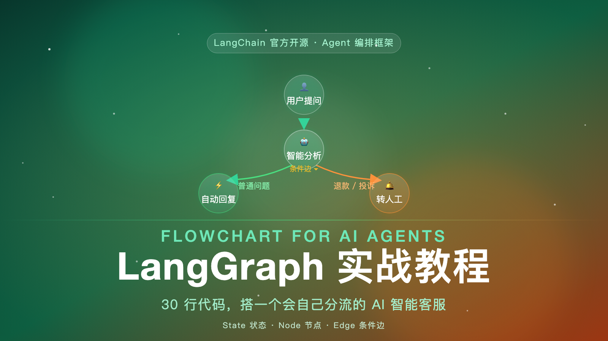

-----


## 上一篇文章我们学了 LangChain，这次呢？

还记得我们上一篇聊过：用 LangChain 的 20 行代码，就能搭一个简单的 AI 应用。但真实的业务，往往不是一条直线。

就拿"AI 智能客服"来说：

- 用户问"怎么查订单进度"，系统应该直接自动回复；
- 用户说"我要退款""我要投诉"，系统却应该**停下来，转给人工**。

同样一个入口，走到一半要"看情况拐弯"。这种**根据情况自己决定下一步**的逻辑，用 LangChain 写起来很别扭，却是另一个框架的主场——**LangGraph**。

今天我们就用 30 行代码，手把手搭一个会"自己分流"的 AI 智能客服。全程不需要任何 API key，装上就能跑。

## LangGraph 是什么？

一句话概括：**LangGraph 是 LangChain 团队推出的"低层编排框架"，专门用来构建有状态、能循环、会分支的 AI Agent。**

如果你用过 LangChain，感受一下两者的差别：

- **LangChain** 是一条"传送带"：原料进去，按固定顺序经过几个工位，从另一端出来。它擅长处理"线性"的流程。
- **LangGraph** 是一张"地铁图"：站点很多，线路有分岔、有环线，你从 A 站上车，坐哪条线、下不下车，**由路上的信号灯决定**。

翻译成技术语言：LangGraph 把 AI 工作流定义成一张**有向图（Directed Graph）**。图里的节点是"干活的函数"，边是"下一步去哪"，而图自己会"看状态、做判断"。这正是复杂 Agent 需要的骨架。

## 四个核心概念，先混个脸熟

在动手之前，先认识四个词，它们就是 LangGraph 的全部家当：

| 概念 | 通俗解释 | 类比 |
|------|---------|------|
| **State 状态** | 整张图共享的一份数据 | 服务员手里的"点菜单" |
| **Node 节点** | 一个干活的函数，会更新状态 | 后厨的"炒菜师傅" |
| **Edge 边** | 节点之间的连线，决定执行顺序 | 出菜口到餐桌的"上菜路线" |
| **条件边** | 特殊的路：看状态来决定走哪条 | 看客人点的是火锅还是面，决定去哪个窗口 |

记住这个"餐厅"比喻，图就通了：**点菜单（State）在师傅们（Node）之间传递，按上菜路线（Edge）走；遇到分岔口，看一眼菜单（条件边）决定去哪个窗口。**

## 实战：30 行代码搭一个智能客服

我们搭一个能"自动分流"的客服机器人：

- **输入**：用户的一句话；
- **分析节点**：判断是普通问题，还是涉及退款/投诉的高危问题；
- **条件边**：普通问题 → 自动回复；高危问题 → 转人工；
- **输出**：最终回复。

**第一步，安装**（Python 3.10 以上）：

```bash
pip install -U langgraph
```

**第二步，写代码**：

```python
from typing import TypedDict
from langgraph.graph import StateGraph, START, END

# ① 定义 State：整张图共享的数据
class State(TypedDict):
    question: str   # 用户提问
    route: str      # 分流结果：normal / escalate
    answer: str     # 最终回复

# ② 节点 = 干活的函数，返回"要更新的字段"
def analyze(state: State) -> dict:
    if "退款" in state["question"] or "投诉" in state["question"]:
        return {"route": "escalate"}   # 高危，转人工
    return {"route": "normal"}         # 普通，自动回复

def auto_reply(state: State) -> dict:
    return {"answer": "【自动回复】已收到你的问题：" + state["question"] + "，我们正在处理。"}

def human_handling(state: State) -> dict:
    return {"answer": "【已转人工】你的问题已升级给客服专员，24 小时内联系你。"}

# ③ 条件边：看 State 决定下一步走哪条路
def decide_next(state: State) -> str:
    return "auto_reply" if state["route"] == "normal" else "human_handling"

# ④ 搭图：把节点、边拼起来
builder = StateGraph(State)
builder.add_node("analyze", analyze)
builder.add_node("auto_reply", auto_reply)
builder.add_node("human_handling", human_handling)
builder.add_edge(START, "analyze")              # 起点 → 分析
builder.add_conditional_edges("analyze", decide_next)  # 分析后分流
builder.add_edge("auto_reply", END)             # 自动回复 → 终点
builder.add_edge("human_handling", END)         # 转人工 → 终点
app = builder.compile()

# ⑤ 运行！
print(app.invoke({"question": "怎么查订单进度？"}))
print(app.invoke({"question": "我要退款！"}))
```

**第三步，看输出**：

```text
{'question': '怎么查订单进度？', 'route': 'normal',   'answer': '【自动回复】已收到你的问题：怎么查订单进度？，我们正在处理。'}
{'question': '我要退款！',       'route': 'escalate', 'answer': '【已转人工】你的问题已升级给客服专员，24 小时内联系你。'}
```

同一个程序，**同样的代码结构**，因为输入不同，走的是两条完全不同的路线。这就是"会自己分流"。

## 拆解这张图：灵魂在"条件边"

你可以把上面的代码翻译成一张图：

```text
  用户提问 → [分析节点] → 条件边判断
                              ├── 普通问题 → [自动回复] → 结束
                              └── 高危问题 → [转人工]   → 结束
```

这 30 行代码里，最值钱的一行是：

```python
builder.add_conditional_edges("analyze", decide_next)
```

它的意思是：**"分析节点"跑完之后，先别急着往下走，让 decide_next 看看当前状态，再决定下一站去哪。**

这一下，AI 应用就从"按固定剧本走"升级成了"边走边决策"。复杂的 Agent 之所以聪明，靠的就是这种**条件分支 + 循环**的骨架。

## 进阶：把"假判断"换成"真模型"

上面例子里，分流用的是 if/else 关键字匹配，刻意省略了 API，好让你**零成本跑通**。真实项目里，把这个节点换成一次大模型调用即可：

```python
def analyze(state: State) -> dict:
    prompt = f"用户说：{state['question']}。这是普通咨询还是投诉？只回答 normal 或 escalate。"
    result = llm.invoke(prompt)              # 调用大模型
    return {"route": result.content.strip()}
```

仅此而已。节点里可以是任意逻辑——调模型、查数据库、发 HTTP 请求，都行。**LangGraph 不关心节点里装了什么，只负责把这些节点优雅地编排起来。**

再往上，LangGraph 还支持：给图加**记忆**（checkpoint，跨轮对话记得上下文）、加**循环**（Agent 自动重试、自我修正）、加**人工审批**（human-in-the-loop，敏感操作先停下来让人确认）、甚至让**多个 Agent 协作**。每一个都是真实生产环境的高频需求。

## 那我到底该用 LangChain 还是 LangGraph？

给你一条好记的判断标准：

- **一条直线能走完**（固定顺序、没有分支）：用 LangChain，更简单；
- **需要看情况拐弯**（分支、循环、要记忆、要人工介入）：用 LangGraph。

事实上，从 LangChain 1.0 开始，官方已经把 Agent 的底层统一建立在 LangGraph 之上。也就是说，**LangGraph 不是可选项，而是进阶的必经之路。**

## 总结

最后把今天的干货串起来：

- **LangGraph = 把 AI 工作流画成"有向图"的编排框架**：LangChain 是传送带，LangGraph 是地铁图。
- 四个核心概念：**State**（共享数据）、**Node**（干活的函数）、**Edge**（连线）、**条件边**（看状态决定方向）。
- **30 行代码就能搭一个会"自己分流"的智能客服**，全程不需要 API key，装上就能跑。
- 进阶方向：换成真模型、加记忆、加循环、加人工审批、多 Agent 协作。
- **一句话决策**：一条直线用 LangChain，要拐弯用 LangGraph。

别怕"编排框架"这四个字。它的思想你已经懂了——**把任务拆成节点，让流程自己会思考。** 这就是未来 AI 应用的样子。

想继续深入，官方文档是最好的起点：
- LangGraph 官方文档：https://langchain-ai.github.io/langgraph/
- LangGraph GitHub：https://github.com/langchain-ai/langgraph
