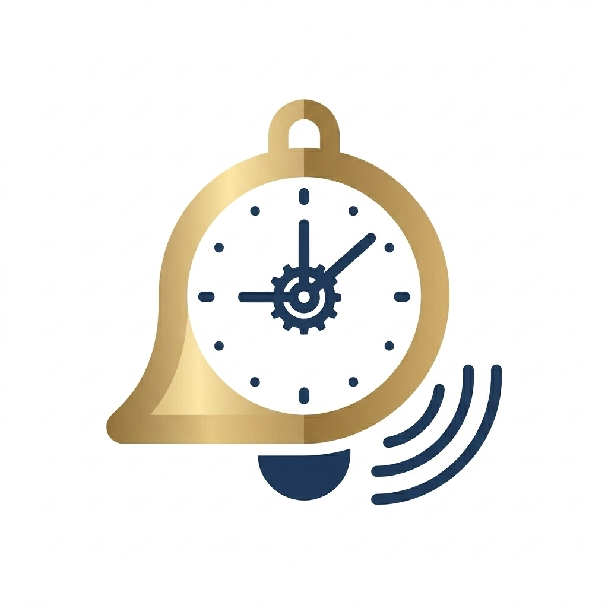

> [!TIP]
> No more setting alarms one by one! Structure your day, anywhere. SchoolBell helps you manage study blocks and breaks with professional school timers.

### SchoolBell: Smart Class Timer
Bring the structure of the classroom to your pocket.
Whether you are a student studying at home, a teacher managing a remote classroom, or a school administrator testing schedules, SchoolBell provides a high-fidelity, automated bell system. Say goodbye to manual timers and stay focused on what matters most: learning.
Key Features:
* Authentic Bell Sounds: Choose from a library of high-quality .m4r and .mp3 school bells, including traditional electric bells, Modern classroom bells.
* Global Schedule Presets: Instantly apply standardized schedules from around the world, including China Middle Schools, Japanese High Schools, South Korean High Schools, and British/American Block schedules.
* Smart Background Alerts: Our advanced notification system ensures the bell rings accurately even if your phone is locked or the app is closed.
* Privacy First: No data collection. Your schedules and settings stay on your device.
  Perfect For:
* Homeschooling: Keep kids on a disciplined routine.
* Self-Study: Use the Pomodoro-style rhythm of a school day to boost productivity.
* School Simulations: Test bell timings and schedules for educational institutions.
* Customize your schedule and effortlessly manage your study plan.
* No Ads.
  Hear the bell. Stay on track. [Download SchoolBell](https://apps.apple.com/us/app/schoolbell-at-home/id6760388986) today.